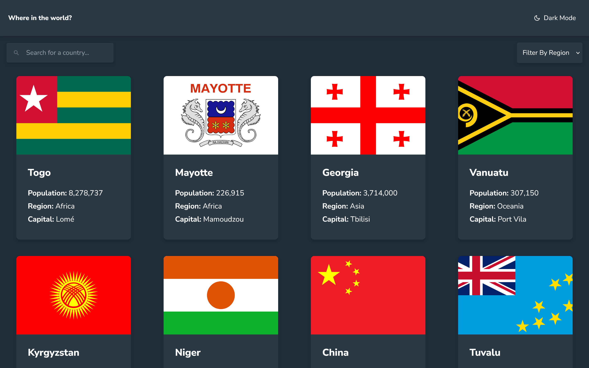
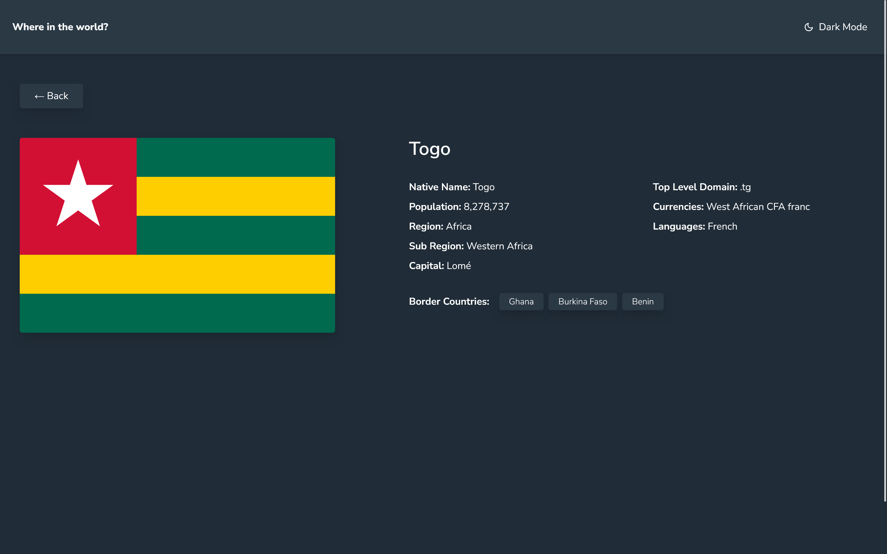
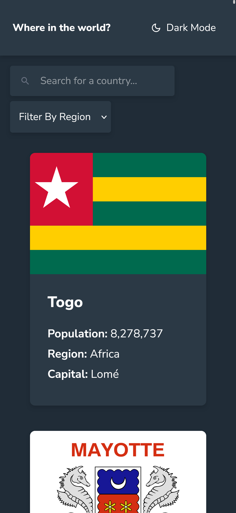
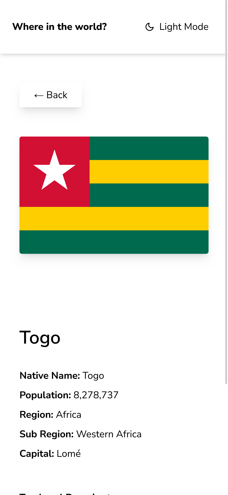
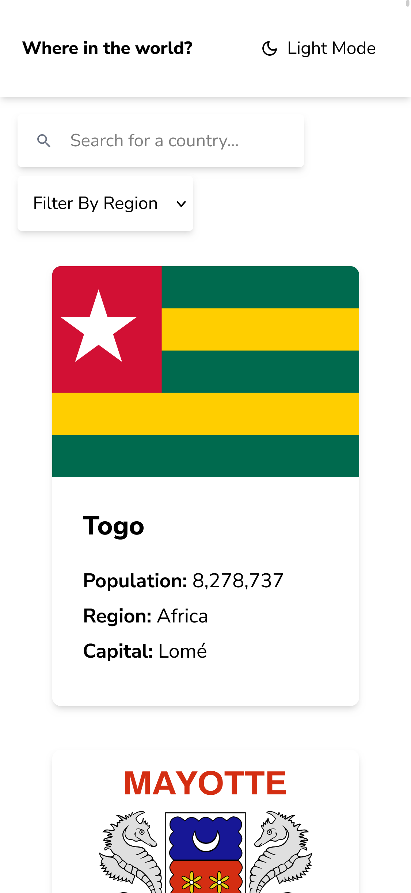

# 🌍 API Countries - Frontend Mentor Challenge

This project is a web application built with **React** and **Vite** that consumes the [REST Countries API](https://restcountries.com/). It allows users to search, filter, and view detailed information about countries, including dark/light mode and navigation between border countries.

---

## 🚀 Features

- **Country list** with search by name and region filter.
- **Detailed view** for each country with extended information.
- **Navigation between border countries** from the detail view.
- **Dark and light mode** with initial preference based on the system and persistent user selection.
- **Responsive** and modern design using TailwindCSS.
- **Dynamic routing** with React Router.

---

## 🛠️ Technologies Used

- [React](https://react.dev/)
- [Vite](https://vitejs.dev/)
- [TailwindCSS](https://tailwindcss.com/)
- [React Router](https://reactrouter.com/)
- [REST Countries API](https://restcountries.com/)

---

## 📦 Installation & Usage

1. **Clone the repository:**
   ```bash
   git clone https://github.com/your-username/api-countries.git
   cd api-countries
   ```

2. **Install dependencies:**
   ```bash
   npm install
   ```

3. **Start the development server:**
   ```bash
   npm run dev
   ```

4. **Open the app in your browser:**
   ```
   http://localhost:5173
   ```

---

## 📸 Screenshots







- Home with list and filters
- Country detail view
- Dark and light mode

---

## 📁 Project Structure

```
src/
│
├── Components/
│   ├── Card.jsx
│   ├── Filters.jsx
│   └── Header.jsx
│
├── Pages/
│   ├── Home.jsx
│   └── Country.jsx
│
├── App.jsx
├── main.jsx
└── index.css
```

---

## 💡 Technical Notes

- Dark/light mode is managed by the `dark` class on the `<html>` element, initialized according to the system preference, but can be changed manually and is saved in `localStorage`.
- Dynamic routing allows access to `/country/:code` for country details.
- Border countries are shown as buttons for quick navigation.

---

## 📚 Credits

- [Frontend Mentor](https://www.frontendmentor.io/) - Original challenge.
- [REST Countries API](https://restcountries.com/) - Data source.

---

## 📝 License

This project is for educational and practice purposes only.

